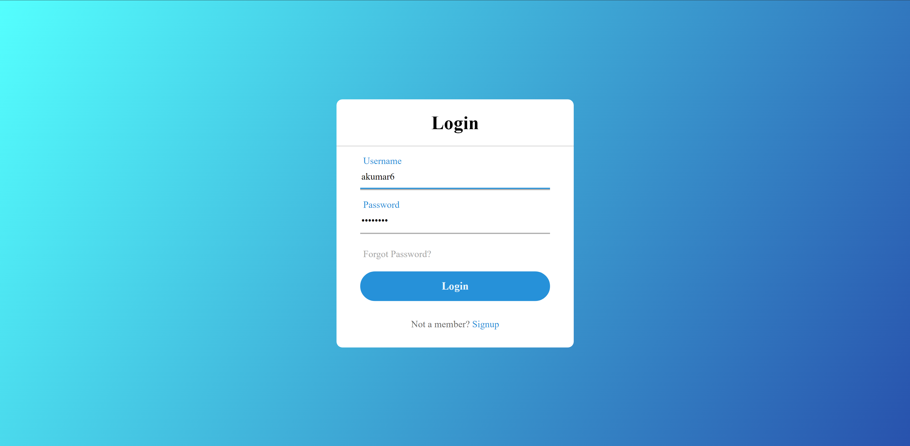
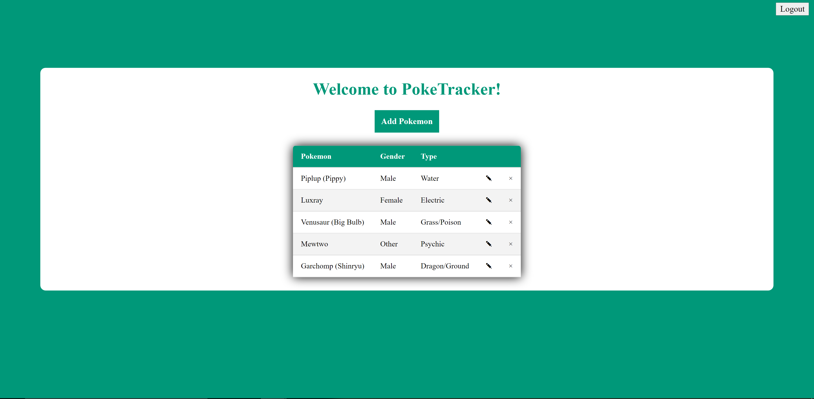
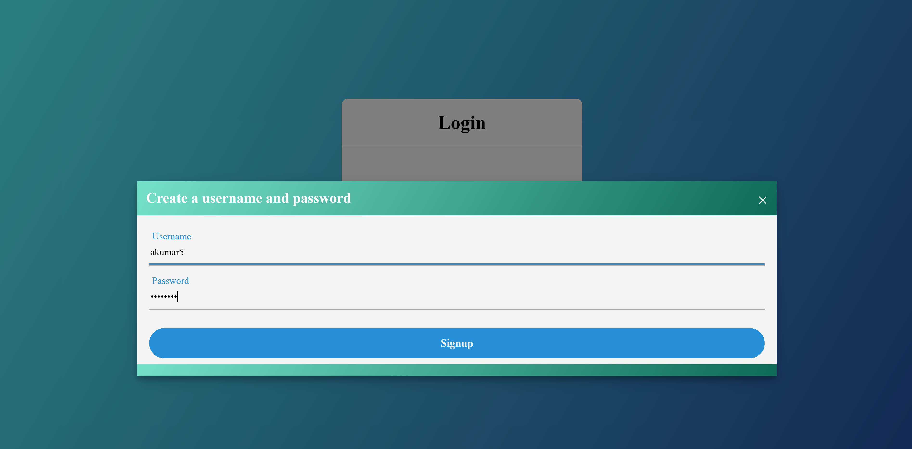

Assignment 3 - Persistence: Two-tier Web Application with Database, Express server, and CSS template
---

## Poketracker

Link: https://a3-hellofellowkids.herokuapp.com/

Guest Credentials: akumar6 / test1234

Name: Aditya Kumar
WPI Email: akumar6@wpi.edu
GitHub Username: hellofellowkids

Welcome to Poketracker! This website allows you to login and track your own Pokemon. We want to keep track of your Pokemon by displaying information about them. 

At the login screen, you can use the sleek inferface to sign in, remember your password, or sign up. The authentication strategy was basically storing the credentials in a mongdodb collection as that is the easiest to implement and do not have the time to setup O-Auth.

Once signed in, you add Pokemon to your tracker. We verify the Pokemon is one that is a known species by using open source **PokeAPI** and able to pull their types. If you want to modify or delete Pokemon you are tracking, click the associated icon on the interface.

The goal of this application was to gain practice using mongodb to preserve user data and become more familar with webware programming. Specifically, making sure there is data associated and specific to each user. Some of the challenges I faced include mostly with styling and trying to make a sleek interface. While I did use the **normalize.css** framework for a simple and normal interface, I made quite a bit of changes to it including (but not limited) to alignment of items, using modal boxes, and generic changes. While I think the interface I have for this framework is passible, there are still a few bugs I have yet to fully iron out.

As for the Express middleware I used (as seen in **server.js**):
1) Mongodb for managing user credentials and data.
2) Cookies for allowing to keep user's sessions.
3) Additional middleware logic that will redirect a user to the main page if user has not logged out
4) Additional middleware logic that will redirect a user to the login page if the user is not logged in 
5) Generic middleware to logging in such as the with the forgot password feature and error messages when a user provides incorrect credentials.

## Technical Achievements
- **Tech Achievement 1**: Utilizing cookies for user convience (5 pts)
Users who have already logged in will be directed to the main page to save some headache. Also, users who have not logged cannot make it to the main page as there is no user to associate the data with.

- **Tech Achievement 2**: Using open-source API (10 pts)
I used open-source PokeAPI in verify the Pokemon the users were entering into the form were known species (no imaginary Pokemon) and pull the types the Pokemon were. While I could made a plug and chug database, learning to using open-source API effectively to pull information, even for something as simple as a Pokemon's characteristics, is important to learn and how to use it (reading API documents, deserializing the info you are looking for in JSON objects, and actually using that information in your site). The code using PokeAPI can be seen in **script.js**. More specifically in fetchPokemon() and getType() functions.

- **Tech Achievement 3**: Hosted website on Heroku (5 pts)

## Design/Evaluation Achievements
- **Design Achievement 1**: Using modal boxes (10 pts)
Each time a user wants to add / edit a Pokemon, remember a password, or signup, a modal box pops up with the appropriate form to fill out to complete the action. While there is some minor bugs, overall the implemententation makes the site feel more dynamic, interactive, and sleek. 

- **Design Achievement 2**: Stylish table design (5 pts)
The table showing the Pokemon you are tracking took quite a bit of time to design to have that sleek, contrasting, look. I also added some nice color changes when hovering over the data when to indicate which Pokemon you are going to edit / delete.
