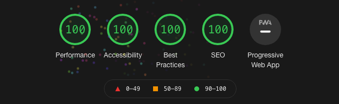

lofi pitter patters to study to
===
*author:* jyalu wu

*assignment:* assignment 3 - persistence: two-tier application with database, express server, and css template

*website links:*

[site hosted on glitch](https://a3-jwu2018.glitch.me/)

[site hosted on heroku](https://lofi-pitter-patters.herokuapp.com)

description
---
this website allows you to listen to chill lofi rain sounds and lofi beats while you study or code or do art or grade this assignment. you can choose the level of rain you want to listen to, whether or not you want lofi music in the background, what environment you want to be in, and also what name you want to give your playlist. a table showing your track mix history is shown on the right, and the user is able to delete old mixes they don't want anymore.

achievements
---
### technical achievements
- **middlewares**: this site uses the cookie-session, serve-static, morgan, cors, and serve-favicon middlewares.
- **sounds**: working with sound files was really tough for me since i'd never done it before. i found a javascript library called howler.js that allows you to use sounds on your website and although it wasn't hard to use, there were so many options and methods, i got a little lost. i found it really difficult to play two sounds at once since howler.js creates a new object for each sound and the objects could be hard to manage. for example, when the user wants to switch to a new rain mix (pressed the "play" button), the old audio objects have to be deleted or else the old sounds and the new sounds would overlap.
- **heroku**: [this site is also hosted on heroku here](https://lofi-pitter-patters.herokuapp.com). heroku seems a lot safer than hosting on glitch since it requires two-factor authentication using an authenticator app. it also doesn't take forever to start up like glitch does when no one has visited the site in a while, which is wicked nice! the heroku admin dashboard also has a *lot* more features than the glitch admin dashboard, though it can be a little much at first - there's a lot going on there.
- **lighthouse**: this site has a 100% on all four lighthouse tests!

### design achievements
- **css framework**: this site uses the skeleton css framework created by dave gamache. it's a very simple framework (he advertises it as "a dead simple, responsive boilerplate") that makes the site look very minimalist chic.
- **custom backgrounds**: you can choose the background for the website using the "environment" button. the background images are overlayed with a black tint to up the contrast and make the font more readable.
- **resources and hints from w3c**: i followed the hints from w3c.
    - *provide informative, unique page titles:* the website title (lofi pitter patters to study to) is unique and references what you can do on the site: listen to rain and lofi beats while you study.
    - *use headings to convey meaning and structure*: the site includes headings that separate the instructions, form, and history table.
    - *make link text meaningful:* the site doesn't use any links, but i did follow this tip for this readme.
    - *write meaningful text alternatives for images:* the background image has a text alternative that describes the images.
    - *create transcripts and captions for multimedia* although the page has audio, it was hard for me to find a way to describe it without cluttering the screen or being redundant since the custom options already describe the sound that is playing. i decided to leave this part alone.
    - *provide clear instructions:* the site includes clear directions on how to use the form and table.
    - *keep content clear and concise:* the instructions, button names, and history headers are all clear and concise.
    - *provide sufficient contrast between foreground and background:* the background images are darkened in order to increase the contrast between the image and the text. the text was also changed to white to further increase the contrast.
    - *don’t use color alone to convey information:* only the color of the radio buttons is used to convey information but the buttons are textured and the color is distinctly different from the white unchecked buttons.
    - *ensure that interactive elements are easy to identify:* interactive elements (buttons and text inputs) follow the same style guidelines as everywhere else on the web so they are easy to identify.
    - *provide clear and consistent navigation options:* this does not apply since there are no navigation options.
    - *ensure that form elements include clearly associated labels:* all labels are right next to the element they are associated with so it is clear what they refer to.
    - *use headings and spacing to group related content:* content is grouped by headings and spaced apart to further distinguish them.
    - *associate a label with every form control:* all the form controls have labels.
    - *identify page language and language changes:* the primary language of the site is in the html file.
    - *use mark-up to convey meaning and structure:* markup is used in the html file to provide structure.
    - *reflect the reading order in the code order:* the elements in the code do match the left-to-right, up-to-down reading order.
    - *write code that adapts to the user’s technology:* the css adapts to different browsers (firefox, safari, chrome, vivaldi are all accounted for).
    - *provide meaning for non-standard interactive elements:* there are no non-standard interactive elements.
    - *avoid captcha where possible:* the website does not use captcha.

resources
---
- home wallpaper: https://wallpapercave.com/w/wp6192898
- car wallpaper: https://wallpapercave.com/w/wp4918883
- train wallpaper: https://wallpapercave.com/w/wp4334662
- forest wallpaper: https://wallpapercave.com/w/wp4649496

- rain sounds: https://mixkit.co/free-sound-effects/rain/

- howler.js: https://howlerjs.com/

- skeleton css framework: http://getskeleton.com

- lofi music:
Green Tea by Purrple Cat | https://purrplecat.com/
Music promoted on https://www.chosic.com/
Creative Commons Attribution-ShareAlike 3.0 Unported (CC BY-SA 3.0)
https://creativecommons.org/licenses/by-sa/3.0/
